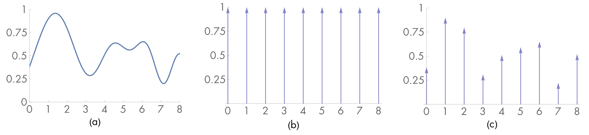
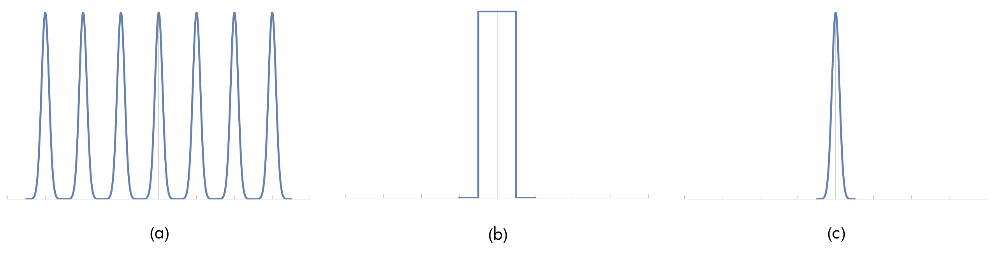

# 介绍
在图形学中，采样很重要的一个部分。现实世界的光照是连续的，而计算机中的图片只能使用离散的形式进行表示，为了表示现实世界的场景，需要对连续的光照进行采样，使用采样的数据作为离散像素的表示，重建场景。

采样和重构都是一个近似的过程，当采样和重建方法不佳时，产生图片会有走样现象。因此，了解采样理论至关重要。

考虑一个一维的连续函数$f(x)$，在函数定义域中对$f(x)$采样得到一系列采样点$x'$和采样值$f(x')$，使用采样点和采样值重构函数$\tilde{f}(x)$来近似原函数$f(x)$。如下图所示。

# 傅立叶分析
傅立叶分析可以评估原函数和重建函数之间的匹配程度，这里主要介绍一下理论思想，证明部分暂时省略。

大部分的函数都可以分解为不同频率的三角函数的求和形式，这种形式是函数的频域表示。傅立叶变换可以将空域空间中的函数转换到频域空间中
$$
F(x) = \int_{-\infty}^\infty f(x) e^{-i 2 \pi \omega x} \mathbf{d} x
$$

Dirac Delta分布函数$\delta(x)$是一个特别的函数，它的定义如下
$$
\forall x \neq 0, \delta(x) = 0 \\
\int \delta(x) \mathbf{d} x = 1
$$
这个函数没有标准的数学表达式，但有一个重要的性质
$$
\int f(x) \delta(x) \mathbf{d}x = f(0)
$$

那么，对于之前描述的采样过程，可以用一个shah函数或impulse train函数与原函数相乘得到采样结果，其中shah函数为
$$
\sh_T(x) = T\sum_i \delta(x - iT)
$$
其中，T表示采样周期，shah函数实际上就是周期为T的脉冲函数，如下图中的(b)所示。采样的定义为
$$
\sh(x)_Tf(x) = T \sum_i \delta(x - iT) f(iT)
$$

通过选择一个重建的滤波函数$r(x)$并在样本值上应用卷积可以到的重建函数，即
$$
\tilde{f}(x) = (\sh_T(x) f(x)) \otimes r(x)
$$
直观地来接，重构函数就是通过在样本点进行插值得到的。

现在，我们假设$f(x)$是带宽有限的，即存在一个最频率$\omega_0$，在$f(x)$的频域空间中，不存在一个频率比$\omega_0$更高，即$\forall \omega \gt \omega_0, F(\omega) = 0$

现在，让我们回到采样过程的数学形式，它是定义在空域空间的，我们也可以将它转换到频域空间中。根据空域空间的乘积等于频域空间的卷积，原函数的频域空间函数记为$F(x)$，而shah函数的频域形式为
$$
\sh_{1/T}(\omega) = (1/T) \sum_i \delta(\omega - i/T)
$$
根据上述表达式可以得知，频域周期为$1/T$。

对于delta分布函数来说，与一个函数进行卷积意味着复制这个函数，因此，在频域空间的采样结果相当于原函数的一个无限副本序列，每个副本的间隔是shah函数的周期，即$1/T$。

为了重建原函数，我们只需要保留频域空间中位于远点的副本即可，如下图所示

如上图所示，为了保留位于远点的函数副本，我们需要乘上一个矩形函数。即令$r(x)$的频域空间形式$R(x)$为
$$
R(x) = \begin{cases}
\frac 1 T , \ |x| \lt \frac T 2 \\
0, \ otherwise
\end{cases}
$$
最终在频域空间的采样过程数学形式为
$$
\tilde{F}(\omega) = ((1/T)\sum_i \delta(\omega -i/T) \otimes F(\omega)) R(x)
$$

因此，为了完美的恢复原函数，对矩形函数应用逆傅立叶变换，得到$r(x)= sinc_T(x)$，归一化的sinc函数表达是为$\frac {sin(\pi x)} {\pi x}$。因此，最终的重建函数为
$$
\tilde{f}(x) = (\sh_T(x) f(x)) \otimes sinc(x)
$$
转为离散的表达形式为
$$
\tilde{f}(x) = \sum_{i=-\infty}^\infty sin(x-iT)f(iT)
$$

sinc函数的定义域是$(-\infty, \infty)$，这意味着，对于每个重建函数的值，我们需要用到所有的样本点，但是，实际上，当$|x|$的值越大的时候，sinc函数的值越小，因此，使用有限的样本进行重建也可以较好的恢复原函数。

## 走样
回顾一下上面的分析，在重建函数的过程中有两个重要的步骤，即在频域空间复制原函数和使用矩形函数提取原函数。

在复制的过程中，我们假设了原函数是带宽有限的，且副本间的距离足够大，因此，每个副本相互独立。

那么，当上述的假设不成立的时候，副本之间就会出现重叠，在应用矩形函数进行提取的时候，得到的不再是原函数的频域表达，而是一个类似的函数，它的低频部分与原函数相同，当频率变高时，其他副本的高频信息混在其中，当频率继续变高，高频部分被剔除。此时，就发生了走样现象。

走样发生在两种情况下
1. 原函数是带宽有限的，但频域空间的shah函数周期过小。
   
   根据shah在空域空间和频域空间的表达式可知，两个的周期互为倒数。因此，在频域空间的周期过小，即在空域空间的周期过大。也就是说，采样频率过小，需要增加采样频率，事实上，根据Nyquist定律可知，采样频率应为最高频率的两倍。
2. 原函数是非带宽有限的。
   
   无法处理，不幸的是，大部分图形学的采样都是这种类型的。

## 反走样
如上文提到的，走样通常是不可避免的，但我们希望减小走样的影响。通常有以下几种技术
1. 非均匀采样：上面理论中使用的都是均匀采样，因此形成的走样结果是规则的，重复的，容易被人们注意到。而使用非均匀采样的时候，在复制的时候加了一个随机的偏移，因此，产生的走样没有规律，更不容易吸引人的注意。
2. 自适应采样：根据Nyquist定律，采样频率应为最高频率的两倍，但是，原函数的最高频率在不同的位置是不同的，在低频的地方会噪声样本点的浪费。自适应采样的思路是在高频的地方是使用高频的采样，在低频的地方使用低频的采样，能够更高效的使用有限数量的样本点。唯一的问题在于难以判断高频的地方。
3. 预过滤：预过滤的思路是对原函数进行滤波，过滤高频的信号，使得原函数变成带宽有限的。

